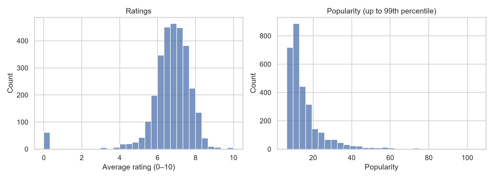
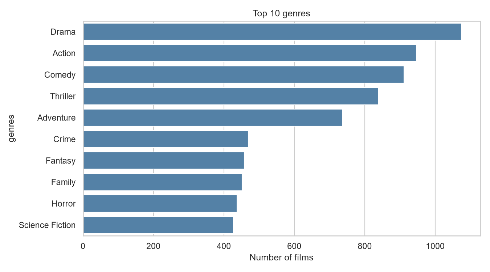
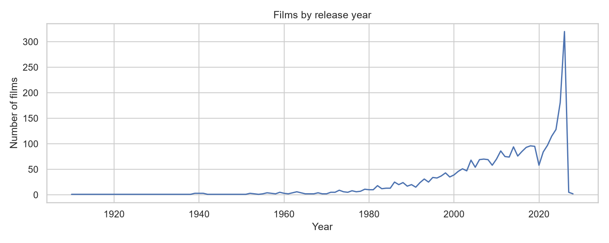
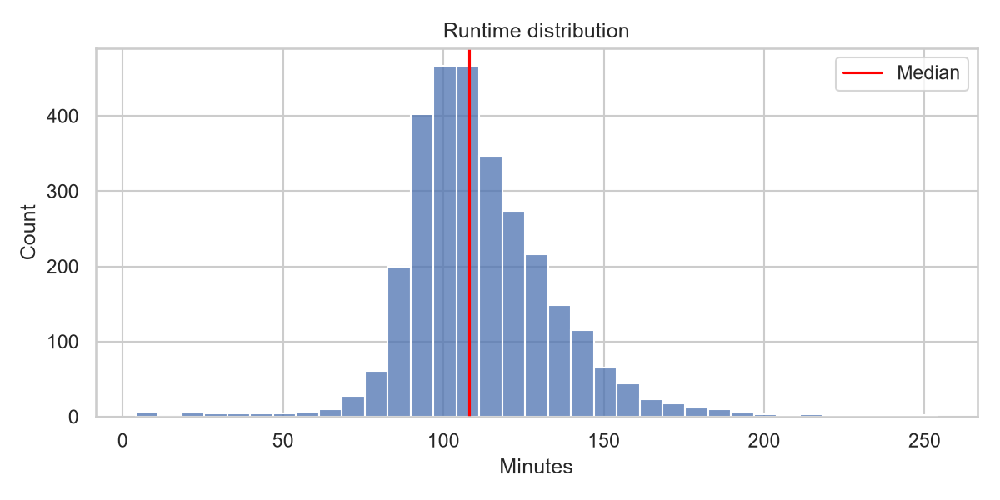
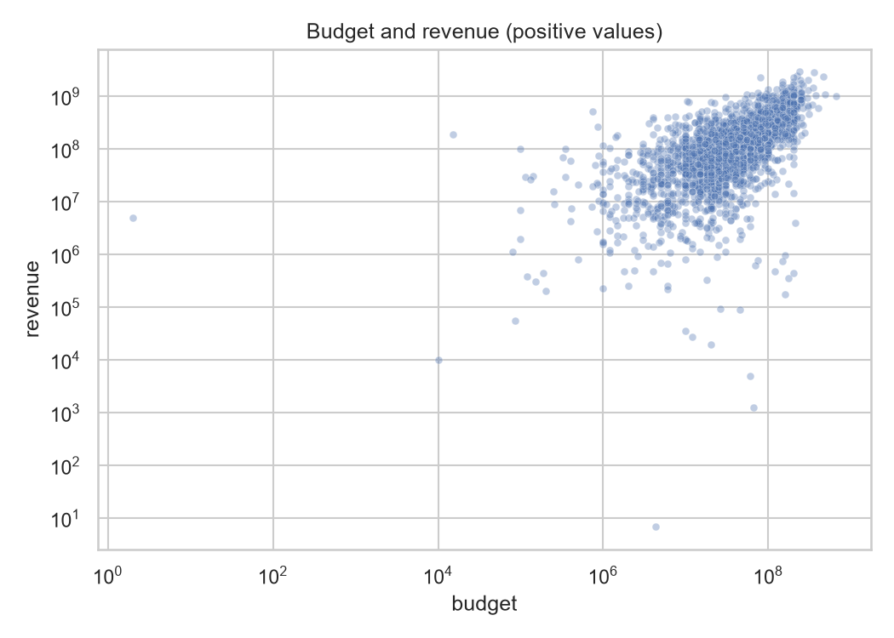
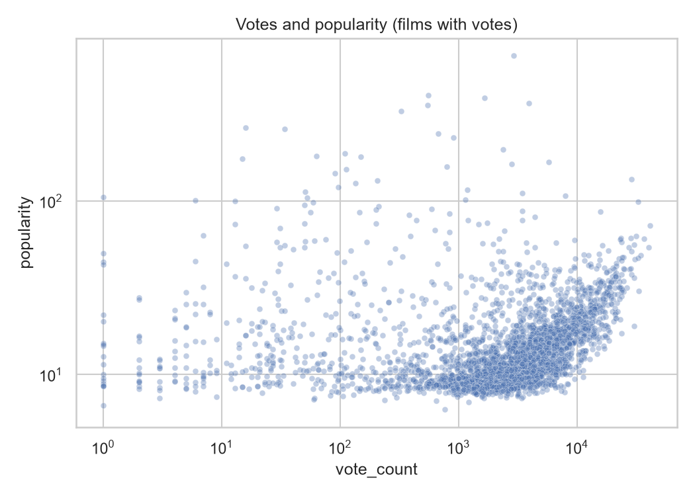
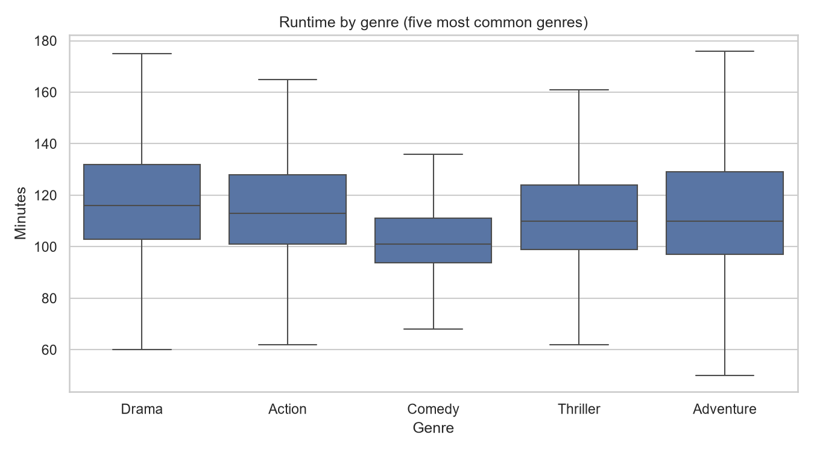
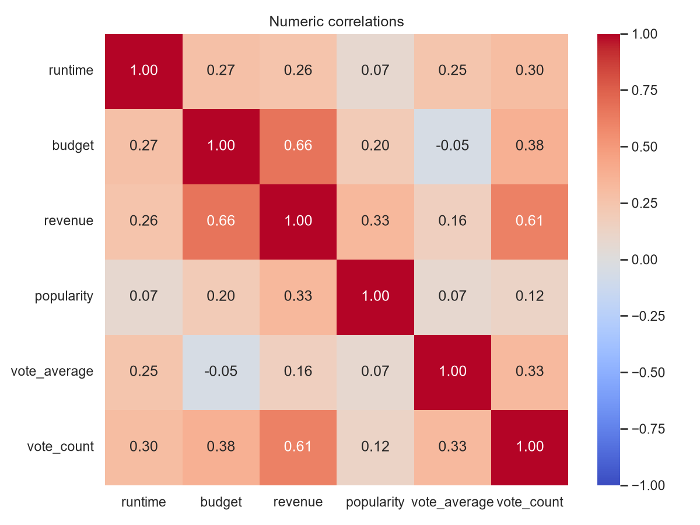

# CineMatch AI — analyse et intelligence des films

Le projet étudie un catalogue de films TMDB pour répondre à deux questions : **quels films ont un fort engagement ?** (classification oui/non) et **quels profils de films se ressemblent ?** (clustering). La recommandation a été retirée du périmètre. Le cahier de travail est conservé dans [cahier_des_charges.txt](cahier_des_charges.txt).

L'engagement sera défini à partir de `vote_count` (nombre de votes). Par exemple, si le seuil retenu est 1 000 votes, un film qui en a 3 000 appartient à la catégorie « fort engagement ». Le seuil définit la réponse à prédire ; il sera choisi et justifié lors de la classification.

## Parcours principal en notebooks

Ouvrir les notebooks dans cet ordre et executer les cellules de haut en bas. La premiere cellule retrouve le dossier du projet depuis la racine ou `notebooks/`.

| Notebook | Role | Verification de cette migration |
| --- | --- | --- |
| [01_extraction](notebooks/01_extraction.ipynb) | Extraction TMDB et reprise | Execute sur le cache de 3000 films, sans nouvel appel API |
| [02_cleaning](notebooks/02_cleaning.ipynb) | Nettoyage et export JSON | Execute |
| [02b_mongodb](notebooks/02b_mongodb.ipynb) | Chargement, requetes et agregation | Execute : 3000 films, requetes et agregation verifiees |
| [03_eda](notebooks/03_eda.ipynb) | Graphiques affiches dans le notebook | Execute |
| [04_features](notebooks/04_features.ipynb) | Donnees originales et variables derivees | Execute |
| [05_tfidf](notebooks/05_tfidf.ipynb) | Exercice TF-IDF actuel, 1000 termes maximum | Execute, etape 5 encore en cours |

Installer les dependances puis lancer `python -m notebook` depuis le projet. Les scripts `src/` restent disponibles pour l'automatisation demandee dans le cahier des charges. Les notebooks deviennent le support principal d'apprentissage. Les etapes 6 a 9 ne sont pas implementees par cette migration.

### Contenu des JSON

- `data/raw/tmdb_raw.json` : source brute preservee.
- `data/processed/movies.json` : 14 champs nettoyes par film.
- `data/processed/movie_features.json` : 39 champs par film, comprenant les 14 champs originaux, les 7 variables derivees et les 18 indicateurs de genre.
- `data/backups/` : copie des JSON traites avant migration.

Le fichier de features conserve donc `overview`, `genres`, `keywords`, `vote_count`, `vote_average`, `popularity`, `budget` et `revenue`. Un indicateur comme `genre_Action` vaut 1 si le film appartient a ce genre et 0 sinon. Plusieurs indicateurs peuvent valoir 1 pour un meme film : aucun genre principal arbitraire n'est impose.

Ce fichier est un jeu de donnees enrichi, pas la matrice finale X. La cible reste `high_engagement` selon le cahier des charges; son seuil sera choisi et justifie a l'etape 6. Si elle est construite avec `vote_count`, cette colonne doit etre exclue de X. Les notes, revenus et popularites observes apres sortie ne conviennent pas a une prediction avant sortie. Le cahier des charges demande high_engagement, pas la prediction du genre. Aucun changement de cible nest applique.

Validation locale : 3000 identifiants uniques, conservation des champs nettoyes, verification des indicateurs de genre et des compteurs sur tous les films. Les notebooks des etapes 1 a 4, MongoDB compris, ont ete executes sans erreur le 05/10/2026. Le notebook 05 avait ete execute pendant la migration precedente. Le TF-IDF sur tous les films est exploratoire; pour evaluer un classifieur, il faudra ajuster le vectoriseur uniquement dans les donnees d'entrainement de chaque decoupage.

## Verification des etapes 1 a 4

Voir [le bilan des exigences](STEPS_1_4_REVIEW.md) et [les mesures de verification](data/processed/steps_1_4_validation.json). Les interpretations accompagnent maintenant chaque graphique dans le notebook EDA; les justifications et limites des features figurent dans le notebook 04.

## Où en est le projet ?

| Étape | Résultat | État |
| --- | --- | --- |
| 1. Extraction | 3 000 films et réponses TMDB dans `data/raw/tmdb_raw.json` | Réalisée |
| 2. Nettoyage | 3 000 films uniques dans `data/processed/movies.json` | Réalisé |
| 2. MongoDB | Code Python de chargement et de requêtes | Verifie : 3000 films, index unique et agregation |
| 3. EDA | Huit graphiques dans `data/processed/plots/` | Réalisée |
| 4. Features | `data/processed/movie_features.json` | Réalisée |
| 5 | TF-IDF exploratoire dans le notebook | En cours |
| 6 et suivantes | Classification, validation, clustering, application | À faire |

**Aucun modèle n'a encore été entraîné.** Les graphiques décrivent les données ; ils ne constituent pas une prédiction.

## Lancer les étapes actuelles

Depuis le dossier du projet, installer les dépendances avec `python -m pip install -r requirements.txt`.

1. Placer son propre jeton TMDB dans `.env` : `TMDB_TOKEN=son_jeton`. Ne pas publier ce fichier.
2. `python src/extract_tmdb.py` : télécharger ou reprendre l'extraction. Le programme conserve les pages et les détails des films dans **un seul JSON brut**.
3. `python src/clean_movies.py` : nettoyer les films et créer le fichier structuré.
4. `python src/eda_movies.py` : recréer les huit graphiques.
5. `python src/create_features.py` : créer les nouvelles variables.
6. Après avoir démarré MongoDB, `python src/load_mongodb.py` : charger les films et afficher deux requêtes et une agrégation des genres. Si MongoDB n'est pas local, définir `MONGO_URL` dans `.env`. **Execute et verifie le 05/10/2026 : 3000 films.**

Les principales données recueillies sont `movie_id`, `title`, `overview`, `release_date`, `runtime`, `original_language`, `genres`, `keywords`, `budget`, `revenue`, `popularity`, `vote_average` et `vote_count`. Le nettoyage convertit les dates et les nombres, supprime les doublons d'identifiant et conserve les valeurs manquantes visibles. Dans ce jeu de données, 39 durées et 2 dates manquent ; les budgets ou revenus égaux à zéro peuvent signifier « inconnu ».

## Étape 3 — Ce que montrent les graphiques

Les observations ci-dessous concernent les **3 000 films extraits actuellement**. L'échantillon `discover/movie` ne représente pas nécessairement tout TMDB.

### Notes et popularité

Note médiane : **6,8/10**. Popularité médiane : **12,3** ; 10 % des films dépassent **29,6**. Le graphique masque le 1 % de popularités les plus élevées pour rester lisible.

### Genres

**Drama** est le genre le plus fréquent (**1 074 films**). Un film peut appartenir à plusieurs genres.

### Années de sortie

**2026** est l'année la plus représentée (**320 films**). Certaines dates futures correspondent à des sorties annoncées.

### Durées

Durée médiane : **108 minutes**. Les **39** durées inconnues ne figurent pas dans ce graphique.

### Budget et revenus

**2 308 films** ont un budget et des revenus positifs. Les axes logarithmiques rendent les montants très différents visibles. Cette relation ne démontre pas qu'un budget élevé cause des revenus élevés.

### Votes et popularité

La corrélation de rang est **0,38** : il existe une association modérée dans cet échantillon. Les films sans vote sont exclus de ce graphique.

### Durée par genre

Pour les cinq genres principaux, les durées médianes vont de **101 à 116 minutes**. Un même film peut apparaître dans plusieurs genres ; les valeurs extrêmes sont masquées sur ce graphique.

### Corrélations numériques

La corrélation linéaire budget–revenus est **0,66**, en traitant leurs zéros comme des valeurs inconnues. Une corrélation ne prouve pas une cause.

## Étape 4 — Features et fuite de données

Une **feature** est une information que l'on donne au modèle. Exemple : un film sorti le 29/07/2026, long de 128 minutes et classé dans trois genres donne `release_year = 2026`, `release_month = 7`, `decade = 2020`, `runtime_category = long` et `genre_count = 3`.

| Feature | Idée |
| --- | --- |
| `release_year`, `release_month`, `decade` | Décrire la période de sortie et étudier une éventuelle saisonnalité. |
| `genre_count` | Compter les genres associés au film. |
| `keyword_count` | Compter les mots-clés TMDB. |
| `overview_word_count` | Mesurer la longueur du résumé. |
| `runtime_category` | Regrouper les durées : moins de 90 min, 90–119 min, 120 min ou plus. |

Les deux dates et les 39 durées manquantes restent manquantes dans le fichier de features. `movie_id` sert uniquement à relier les fichiers, pas à entraîner un modèle.

**Data leakage** signifie qu'un modèle reçoit déjà la réponse, ou une information indisponible au moment où il doit prédire. Puisque `high_engagement` viendra de `vote_count`, le nombre de votes ne peut pas être une feature. Pour une prédiction **avant la sortie**, la popularité, la note et les revenus observés après sortie doivent aussi être exclus. La disponibilité des mots-clés à ce moment doit être vérifiée avant de les utiliser. L'année de sortie peut refléter le temps laissé à un film pour accumuler des votes : il faudra en tenir compte lors de la validation.

Les données TMDB actuelles sont une photographie prise à un seul moment. Elles ne prouvent pas qu'une vraie prédiction avant sortie fonctionnerait : pour cela, il faudrait des features enregistrées avant la sortie et des votes mesurés ensuite. Les futurs scores de classification seront donc des **résultats expérimentaux**.

## Prochaines étapes ML

1. **TF-IDF** : transformer les mots des résumés en nombres pour pouvoir comparer les textes.
2. **Classification** : définir `high_engagement`, séparer entraînement et test, puis comparer Logistic Regression, Random Forest et Linear SVM avec les métriques demandées.
3. **Validation croisée et GridSearchCV** : vérifier si les résultats restent stables sur plusieurs découpages et essayer plusieurs réglages.
4. **K-Means** : créer des groupes sans étiquettes connues, comparer plusieurs valeurs de `K` avec le Silhouette Score et décrire les groupes obtenus.
5. **Intégration** : construire Streamlit, automatiser avec Airflow, préparer Docker, tests et diagramme d'architecture.

Pour les concepts : [guide scikit-learn TF-IDF](https://scikit-learn.org/stable/modules/feature_extraction.html#text-feature-extraction), [fuites de données](https://scikit-learn.org/stable/common_pitfalls.html), [validation croisée](https://scikit-learn.org/stable/modules/cross_validation.html), [K-Means](https://scikit-learn.org/stable/modules/clustering.html#k-means), [MongoDB agrégations](https://www.mongodb.com/docs/manual/aggregation/).
